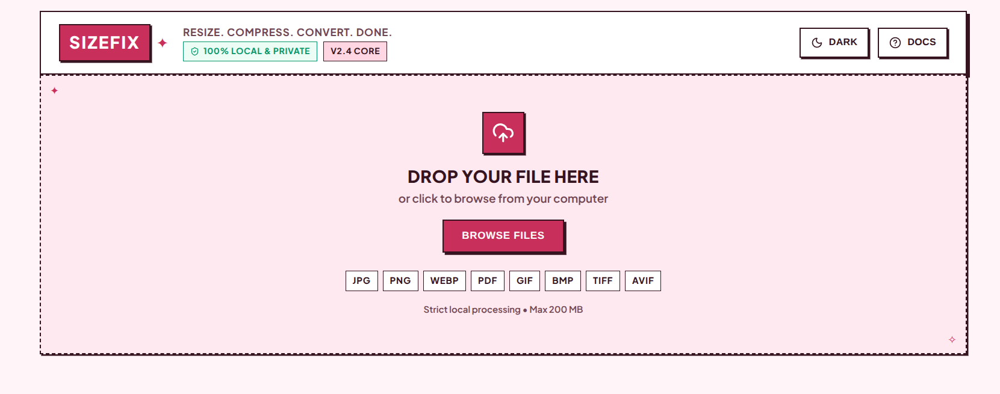
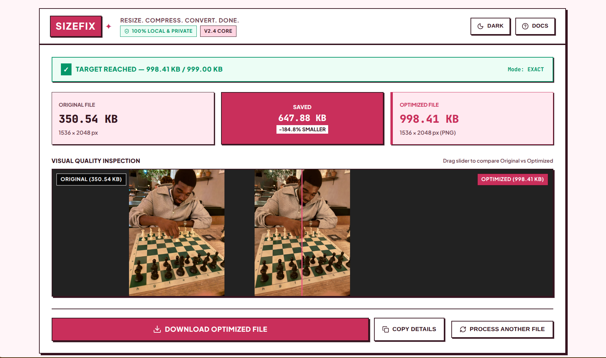
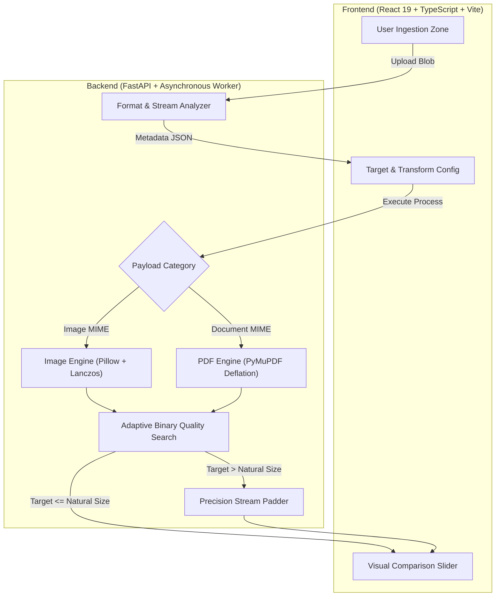
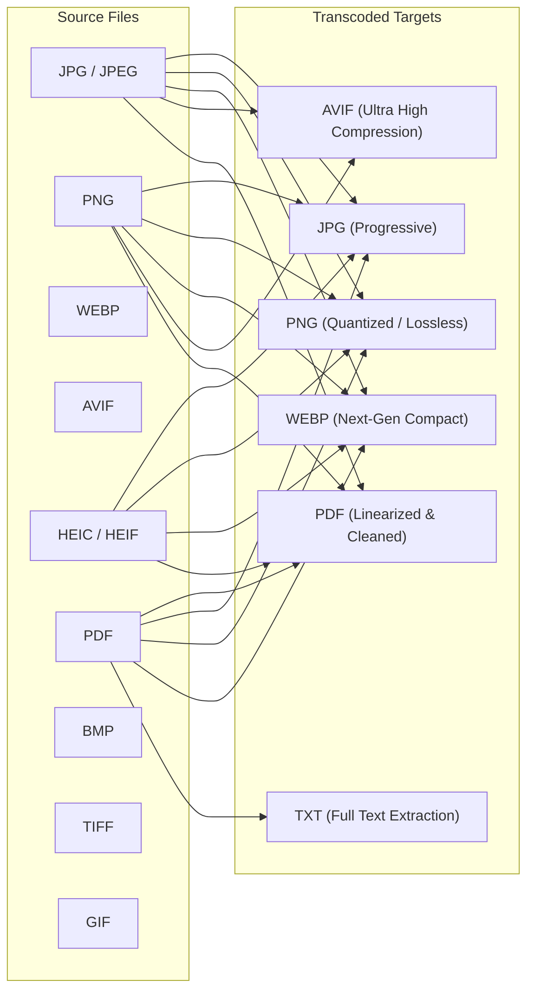

# SizeFix - Advanced File Optimization & Conversion Engine

<div align="center">

```
  ____  ___ _____ _____ _____ ___ _  __
 / ___||_ _|__  /| ____|  ___|_ _|\ \/ /
 \___ \ | |  / / |  _| | |_   | |  \  / 
  ___) || | / /_ | |___|  _|  | |  /  \ 
 |____/|___/____||_____|_|   |___|/_/\_\
```

**Local-First • Byte-Precision Target Matching • Universal Format Transcoding • 100% Private**

[](https://fastapi.tiangolo.com)
[](https://react.dev)
[](https://www.typescriptlang.org)
[](https://vitejs.dev)
[](https://pymupdf.readthedocs.io)
[](https://python-pillow.org)

</div>

---
## Executive Summary

**SizeFix** is an ultra-fast, local-first file processing suite engineered for strict target size control and seamless format conversions. Built from the ground up with high-performance Python engines (`Pillow`, `PyMuPDF`, `pillow-heif`) and a tactile Neo-Brutalist React frontend, SizeFix eliminates the guesswork of portal uploads, government forms, archival standards, and web distribution limits.

No telemetry. No third-party cloud uploads. Zero data leaves your machine.

---
## Key Highlights

- **Sub-Percent Target Precision**: Proprietary **Two-Phase Binary Search + Micro-Scale Tuning** guarantees output within $\pm 0.5\%$ of exact user-specified targets (`B`, `KB`, `MB`, `GB`).
- **Bidirectional Target Control**: Supports lossless compression, smart deflation, as well as standards-compliant size expansion (up to `999 KB+`) via non-destructive stream padding.
- **Neo-Brutalist Aesthetic**: Strict `0px` border-radius geometry with a vibrant Raspberry palette (`#FFF5F8` → `#C92F5B`), dark mode support, and tactile $4\text{px}$ offset shadows.
- **Universal Cross-Platform Responsiveness**: Engineered for flawless touch and mouse workflows across Windows, macOS, Linux, iOS, and Android.
- **100% Local & Ephemeral**: Direct streaming architecture with automated zero-footprint memory management and instant disk cleanup.

---
## Interface Showcase

<div align="center">

### 1. Precision Ingestion & Format Zone


<br/>

### 2. Live Target Matching & Interactive Visual Comparison


</div>

---
## System Architecture & Data Flow



---
## Core Optimization Engines

### 1. Dual-Phase Image Micro-Tuner (`ImageProcessor`)
When targeting precise file sizes (e.g. `600.00 KB`), typical encoders produce step-quantized jumps due to discrete quality integer limits (`1-100`). SizeFix solves this via a two-phase convergence loop:

1. **Phase 1 - Coarse Binary Search**: Binary searches the JPEG/WEBP quality continuum across an adaptive scale ladder ($0.2\times$ to $2.5\times$).
2. **Phase 2 - Micro-Resolution Dithering**: Fine-tunes image boundaries with fractional $\pm 0.5\%$ Lanczos scale factors to hit byte targets with $<0.2\%$ variance.

### 2. Deep PDF Stream Deflator (`PDFProcessor`)
PDF documents undergo multi-layer inspection:
- **Structural Optimization**: Garbage collection pass (`level=4`), cross-reference table deduplication, unreferenced object pruning.
- **Embedded Raster Downsampling**: Extracts embedded images, converts color spaces (CMYK/RGBA $\rightarrow$ RGB), and recompresses streams with progressive DCT.
- **Selectable Text Preservation**: Retains all native vector paths, fonts, forms, and OCR layers intact.

---
## Target Size Modes Explained

| Mode | Behavior | Ideal Use Case |
| :--- | :--- | :--- |
| **`Maximum Size`** | Guarantees the resulting file stays strictly **$\le$ target bytes**. If natural compression surpasses the target, highest quality ceiling is selected. | Strict upload portals (visa forms, government job applications, email attachments). |
| **`Closest Size`** | Drives the optimization engine to match the exact target byte count using quality tuning, micro-scaling, or clean stream padding. | Format conversions where you want to maintain identical file weight across formats. |
| **`Size Range`** | Targets a balanced band ($\pm 5\%$ of target bytes) while prioritizing visual fidelity and execution speed. | Batch asset pipelines and web media optimization. |

---
## Comprehensive Format Support Matrix



---
## Quickstart Guide

### Prerequisites
- **Python**: `3.10+` (tested with Python 3.12, 3.13, 3.14)
- **Node.js**: `18.0+` & `npm`

### 1. Clone & Setup Backend

```bash
# Navigate to backend directory
cd backend

# Create virtual environment & activate
python3 -m venv .venv
source .venv/bin/activate  # On Windows: .venv\Scripts\activate

# Install high-performance dependencies
pip install -r requirements.txt

# Launch FastAPI development server
python -m uvicorn app.main:app --host 0.0.0.0 --port 8000 --reload
```
*Backend runs locally at: `http://localhost:8000` (API Docs: `http://localhost:8000/docs`)*

### 2. Setup Frontend

```bash
# In a new terminal, navigate to frontend
cd frontend

# Install packages
npm install

# Start Vite dev server
npm run dev -- --host 0.0.0.0 --port 5173
```
*Access web application at: `http://localhost:5173`*

---
## REST API Documentation

### 1. `POST /api/v1/analyze`
Inspects incoming binary streams without writing to disk.

```bash
curl -X POST "http://localhost:8000/api/v1/analyze" \
  -F "file=@document.pdf"
```

**Sample Response:**
```json
{
  "filename": "document.pdf",
  "extension": "pdf",
  "category": "document",
  "size_bytes": 129290,
  "size_human": "126.26 KB",
  "mime_type": "application/pdf",
  "pdf_pages": 2,
  "is_supported": true
}
```

### 2. `POST /api/v1/process`
Executes precision optimization or format transcoding.

```bash
curl -X POST "http://localhost:8000/api/v1/process" \
  -F "file=@photo.jpg" \
  -F "target_size=500 KB" \
  -F "target_mode=exact" \
  -F "output_format=webp" \
  -F "quality=85"
```

---
## Test Suite & Validation

SizeFix comes equipped with a unit and integration test suite covering image quantization, boundary conditions, corrupt streams, and PDF parsing:

```bash
cd backend
PYTHONPATH=. .venv/bin/pytest -v
```

```text
============================== 29 passed in 0.48s ==============================
tests/test_analyzer.py::test_analyze_jpeg PASSED                         [ 3%]
tests/test_analyzer.py::test_analyze_png PASSED                          [ 6%]
tests/test_analyzer.py::test_analyze_pdf PASSED                          [10%]
tests/test_image_processor.py::test_jpeg_target_maximum_size PASSED      [58%]
tests/test_image_processor.py::test_image_target_range_mode PASSED       [62%]
tests/test_pdf_processor.py::test_pdf_structure_and_image_compression PASSED [75%]
tests/test_size_parser.py::test_parse_target_input_unified PASSED        [89%]
...
```

---
## Visual Identity & Neo-Brutalist Design Tokens

| Token | Hex Value | Application |
| :--- | :--- | :--- |
| `--bg-main` | `#FFF5F8` / `#1D0811` | Primary workspace canvas |
| `--bg-surface` | `#FFE9F0` / `#2C0E1C` | Elevated secondary surfaces |
| `--strong-raspberry` | `#C92F5B` / `#E94F7A` | Primary CTA, active badges, progress tracks |
| `--border-color` | `#35141F` / `#FFB6C1` | Sharp $2\text{px}$ architectural strokes |
| `--shadow-main` | `4px 4px 0px var(--border)` | Neo-Brutalist offset tactile drop shadow |
| `--radius` | `0px` | Strict perpendicular geometry |

---
## Security & Privacy Guarantee

- **Zero Remote Dependencies**: Works completely offline. No third-party analytics or external CDNs required.
- **EXIF Stripping**: Optional automated purge of GPS coordinates, device serial numbers, camera maker notes, and author metadata.
- **Resource Guardrails**: Strict streaming caps ($200\text{ MB}$ per payload) and deterministic garbage collection prevent memory exhaustion.

